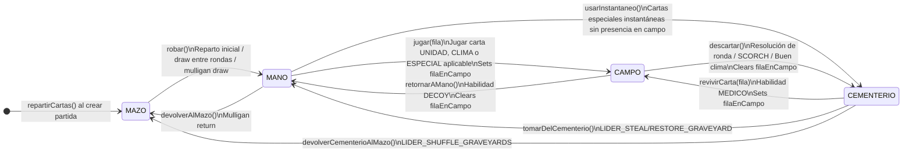

# Máquina de estados de cartas — ingame-service

Este documento describe el diseño y funcionamiento de `CartaPartidaStateMachine`, el componente que centraliza todas las transiciones de estado de las cartas durante una partida, y `HabilidadService`, que implementa los efectos de cada habilidad usando esas transiciones.

---

## Por qué existe

Antes de la máquina de estados, las transiciones de zona estaban dispersas en seis puntos distintos de `PartidaService`:

```java
// Antes — disperso, sin validación, efectos secundarios repetidos
carta.setZona(ZonaCarta.CEMENTERIO);
carta.setFilaEnCampo(null);          // ← fácil de olvidar
```

Ese modelo presentaba tres problemas:

1. **Sin validación de transición** — era posible escribir `CEMENTERIO → CAMPO` sin ningún error.
2. **Efectos secundarios duplicados** — `filaEnCampo` debía limpiarse manualmente en cada punto donde una carta salía del campo.
3. **Extensibilidad nula** — agregar una nueva transición (ej. habilidad MEDICO) requería buscar y modificar múltiples métodos en `PartidaService`.

`CartaPartidaStateMachine` resuelve los tres problemas: un único lugar que conoce qué transiciones son legales, ejecuta los efectos secundarios y falla explícitamente si se intenta algo inválido.

---

## Estados

Los estados son valores del enum `ZonaCarta` (`ingame-service/.../domain/enums/ZonaCarta.java`). Cada valor representa la ubicación física de una carta dentro de una partida.

| Estado | Tabla | Descripción |
|---|---|---|
| `MAZO` | `gw_carta_partida` | La carta está en el mazo del jugador, pendiente de ser robada. |
| `MANO` | `gw_carta_partida` | La carta está en la mano del jugador, lista para jugarse. Solo el propio jugador la ve. |
| `CAMPO` | `gw_carta_partida` | La carta fue jugada en el tablero. Siempre visible. `filaEnCampo` indica en qué fila. Las cartas de slot lateral también están en CAMPO con `esSlotLateral = true`. |
| `CEMENTERIO` | `gw_carta_partida` | La carta fue descartada al resolver una ronda. Visible para ambos jugadores. |

> Cada `CartaPartida` es una fila independiente. Si un mazo declara "Infantería x3", se crean tres instancias de `CartaPartida`, cada una con su propio `zona`.

---

## Diagrama de estados



---

## Mapa de transiciones

```
MAZO        ──── robar() ──────────────────► MANO
MANO        ──── devolverAlMazo() ──────────► MAZO
MANO        ──── jugar(fila) ──────────────► CAMPO
MANO        ──── usarInstantaneo() ─────────► CEMENTERIO   ← LIDER_DISCARD_DRAW
CAMPO       ──── descartar() ──────────────► CEMENTERIO
CAMPO       ──── retornarAMano() ───────────► MANO          ← DECOY
CEMENTERIO  ──── revivirCarta(fila) ────────► CAMPO         ← MEDICO
CEMENTERIO  ──── tomarDelCementerio() ──────► MANO          ← LIDER_STEAL/RESTORE_GRAVEYARD
CEMENTERIO  ──── devolverCementerioAlMazo() ► MAZO          ← LIDER_SHUFFLE_GRAVEYARDS
```

Implementado como `Map<ZonaCarta, EnumSet<ZonaCarta>>` en `CartaPartidaStateMachine`:

```java
private static final Map<ZonaCarta, EnumSet<ZonaCarta>> TRANSICIONES = Map.of(
    ZonaCarta.MAZO,       EnumSet.of(ZonaCarta.MANO),
    ZonaCarta.MANO,       EnumSet.of(ZonaCarta.MAZO, ZonaCarta.CAMPO, ZonaCarta.CEMENTERIO),
    ZonaCarta.CAMPO,      EnumSet.of(ZonaCarta.CEMENTERIO, ZonaCarta.MANO),
    ZonaCarta.CEMENTERIO, EnumSet.of(ZonaCarta.CAMPO, ZonaCarta.MANO, ZonaCarta.MAZO)
);
```

---

## API pública del componente

**Clase:** `com.arimar.gwent.ingameservice.service.CartaPartidaStateMachine`  
**Spring bean:** `@Component` — se inyecta por constructor en `PartidaService` y `HabilidadService`.

---

### `robar(CartaPartida carta)`

**Transición:** `MAZO → MANO`

**Cuándo se usa:**

| Contexto | Llamado desde |
|---|---|
| Reparto inicial al crear la partida | `PartidaService.repartirCartas()` |
| Draw aleatorio durante mulligan | `PartidaService.mulligan()` |
| Robo de cartas entre rondas | `PartidaService.robarCartas()` |
| ESPIA: el jugador roba 2 cartas | `HabilidadService.procesarEspia()` |

**Efectos secundarios:** ninguno (solo cambia `zona`).

---

### `devolverAlMazo(CartaPartida carta)`

**Transición:** `MANO → MAZO`

**Cuándo se usa:** cuando el jugador devuelve una carta durante la fase de mulligan.

**Efectos secundarios:** ninguno.

---

### `jugar(CartaPartida carta, FilaCarta fila)`

**Transición:** `MANO → CAMPO`

**Cuándo se usa:** cuando el jugador con turno juega cualquier carta jugable (UNIDAD, CLIMA, ESPECIAL aplicable).

**Efectos secundarios:** establece `carta.filaEnCampo = fila`.

La fila se resuelve antes de llamar a este método:
- Cartas con `fila = AGIL` → la fila viene del request (`CUERPO_A_CUERPO` o `DISTANCIA`).
- Cartas `DECOY` → `fila = null`; `procesarDecoy` la actualiza al valor de la carta objetivo.
- Cartas de **slot lateral** (Cuerno del Comandante, Mardroeme ESPECIAL) → la fila viene del request y se valida que el slot esté libre.
- Cartas instantáneas (Buen clima, Scorch especial) → `fila = null`; se descartan tras el efecto.
- Resto → la fila proviene de `CartaCatalogo.fila`.

---

### `descartar(CartaPartida carta)`

**Transición:** `CAMPO → CEMENTERIO`

**Cuándo se usa:**

| Contexto | Llamado desde |
|---|---|
| Resolución de ronda (todas las cartas del campo) | `PartidaService.resolverRonda()` |
| SCORCH / SCORCH_FILA: unidades destruidas | `HabilidadService.procesarScorch()` |
| Buen clima: cartas CLIMA eliminadas | `HabilidadService.procesarBuenClima()` |
| Scorch (ESPECIAL) se descarta a sí mismo | `HabilidadService.procesarScorch()` |

**Efectos secundarios:** limpia `carta.filaEnCampo = null`.

---

### `revivirCarta(CartaPartida carta, FilaCarta fila)`

**Transición:** `CEMENTERIO → CAMPO`

**Cuándo se usa:** habilidad MEDICO — revive una unidad no-héroe del cementerio al campo.

**Efectos secundarios:** establece `carta.filaEnCampo = fila`.

**Llamado desde:** `HabilidadService.procesarMedico()`

---

### `retornarAMano(CartaPartida carta)`

**Transición:** `CAMPO → MANO`

**Cuándo se usa:** habilidad DECOY — la unidad objetivo regresa a la mano del jugador.

**Efectos secundarios:** limpia `carta.filaEnCampo = null`.

**Llamado desde:** `HabilidadService.procesarDecoy()`

---

### `usarInstantaneo(CartaPartida carta)`

**Transición:** `MANO → CEMENTERIO`

**Cuándo se usa:** descarta directamente desde la mano sin pasar por el campo.

| Contexto | Llamado desde |
|---|---|
| LIDER_DISCARD_DRAW: descartar las 2 cartas elegidas | `LiderService.procesarDiscardDraw()` |

> Nota: las cartas instantáneas de juego normal (Buen clima, Scorch ESPECIAL) primero pasan por `CAMPO` via `jugar()` y luego se descartan via `descartar()`. `usarInstantaneo()` se usa cuando el descarte ocurre directamente desde la mano.

**Efectos secundarios:** ninguno.

---

### `tomarDelCementerio(CartaPartida carta)`

**Transición:** `CEMENTERIO → MANO`

**Cuándo se usa:**

| Contexto | Llamado desde |
|---|---|
| LIDER_STEAL_GRAVEYARD: tomar carta del cementerio del oponente (cambia `jugadorId`) | `LiderService.procesarStealGraveyard()` |
| LIDER_RESTORE_GRAVEYARD: tomar carta del propio cementerio | `LiderService.procesarRestoreGraveyard()` |

**Efectos secundarios:** ninguno (la carta queda en `MANO` del jugador; `filaEnCampo` ya era `null` en `CEMENTERIO`).

---

### `devolverCementerioAlMazo(CartaPartida carta)`

**Transición:** `CEMENTERIO → MAZO`

**Cuándo se usa:**

| Contexto | Llamado desde |
|---|---|
| LIDER_SHUFFLE_GRAVEYARDS: devolver todas las cartas del cementerio al mazo (ambos jugadores) | `LiderService.procesarShuffleGraveyards()` |

**Efectos secundarios:** ninguno.

---

## Manejo de transiciones inválidas

El método interno `transicionar()` valida que la transición solicitada esté en el mapa antes de aplicarla:

```java
private void transicionar(CartaPartida carta, ZonaCarta destino) {
    ZonaCarta origen = carta.getZona();
    EnumSet<ZonaCarta> permitidos = TRANSICIONES.getOrDefault(origen, EnumSet.noneOf(ZonaCarta.class));
    if (!permitidos.contains(destino)) {
        throw new IllegalStateException(
            "Transición de carta inválida: %s → %s (cartaPartidaId=%d)"
                .formatted(origen, destino, carta.getId())
        );
    }
    carta.setZona(destino);
}
```

`IllegalStateException` es intencionalmente un error de servidor (no de cliente):
- Si ocurre en producción, **es un bug en la lógica de juego**, no un input inválido.
- `GlobalExceptionHandler` de ingame-service la captura y devuelve `500 Internal Server Error`.
- El mensaje incluye `origen`, `destino` y `cartaPartidaId` para facilitar el diagnóstico.

Las validaciones de negocio (carta no en mano, no es tu turno, slot lateral ocupado, etc.) son responsabilidad de `PartidaService` y `HabilidadService`, y usan `ResponseStatusException` con códigos `4xx` apropiados.

---

## HabilidadService — efectos de habilidades

`HabilidadService` es el único lugar donde se implementa la lógica de cada habilidad. `PartidaService` lo llama en dos puntos:

1. **`jugarCarta()`** → `habilidadService.procesarAlJugar()` — efectos on-play
2. **`resolverRonda()`** → `habilidadService.calcularFuerzaTotal()` — modificadores pasivos

### Habilidades activas (on-play)

| Habilidad | Tipo carta | Efecto |
|---|---|---|
| `ESPIA` | UNIDAD | La carta pasa al campo del OPONENTE. El jugador roba 2 cartas. |
| `MEDICO` | UNIDAD | Si se envía `reviveCartaId`: revive unidad no-héroe del cementerio al campo. |
| `MUSTER` | UNIDAD | Todas las copias del mismo `cartaCatalogoId` en el MAZO pasan al CAMPO. |
| `DECOY` | ESPECIAL | La unidad `targetCartaId` del campo regresa a mano. DECOY ocupa su fila. |
| `CLIMA_LIMPIO` | ESPECIAL | Elimina todas las cartas CLIMA del campo (ambos jugadores) + se descarta a sí mismo. |
| `SCORCH` | ESPECIAL / UNIDAD | Destruye la(s) unidad(es) con mayor fuerza efectiva en ambos campos si total ≥ 10. Si es ESPECIAL, se descarta tras el efecto. |
| `SCORCH_FILA` | UNIDAD | Destruye la(s) unidad(es) enemigas más fuertes en su fila si el total enemigo de esa fila ≥ 10. |
| `BERSERKER` | UNIDAD | Se transforma (usa `fuerzaTransformada`) si Mardroeme está en la misma fila. |
| `MARDROEME` | UNIDAD / ESPECIAL | Transforma todos los BERSERKER en su fila. Como ESPECIAL va al slot lateral. |

### Habilidades pasivas (modifican fuerza en calcularFila)

| Habilidad | Efecto |
|---|---|
| `ENLACE_APRETADO` | Cada copia del mismo nombre en la fila multiplica su fuerza por el número de copias. |
| `VINCULO_ESTRECHO` | Mismo mecánico que ENLACE_APRETADO. |
| `REFUERZO_MORAL` | Cada carta MORAL otorga +1 a todas las unidades no-héroe de su fila (excepto a sí misma). |
| `CUERNO_DEL_COMANDANTE` | Dobla el total de la fila; anulado si hay clima activo en esa fila. Puede ser unidad o slot lateral. |

### Cartas CLIMA y su efecto pasivo

| Habilidad | Filas afectadas | Descripción |
|---|---|---|
| `NINGUNA` (cartas CLIMA estándar) | La fila de `filaEnCampo` | Reduce unidades no-héroe a 1 en esa fila. |
| `TORMENTA_SKELLIGE` | `DISTANCIA` + `ASEDIO` | Reduce no-héroes a 1 en ambas filas simultáneamente. |

El clima no tiene case en `procesarAlJugar` — su efecto es puramente pasivo, detectado en tiempo real por `resolverClimaActivo()`.

### Campos opcionales en JugarCartaRequest

```java
// Para MEDICO
private Long reviveCartaId;   // CartaPartida en CEMENTERIO a revivir
private FilaCarta reviveFila; // Solo necesario si la carta a revivir es AGIL

// Para DECOY
private Long targetCartaId;   // CartaPartida en CAMPO a devolver a la mano

// Para slot lateral (Cuerno del Comandante, Mardroeme ESPECIAL)
private FilaCarta fila;       // Fila donde se asigna el slot lateral (obligatorio)
```

---

## LiderService — habilidades de líder

`LiderService` es el componente exclusivo para todas las habilidades de líder. `PartidaService` lo invoca desde `usarLider()`.

```
usarLider(jugadorId, partidaId, req)
  ├── validateTurno / validateLiderUsado / validatePaso
  ├── liderService.procesarLider(partida, jugadorId, req)
  │     ├── getLiderHabilidad(partida, jugadorId)     ← obtiene habilidad del líder del mazo
  │     └── switch (habilidad) → método específico
  ├── marcar liderUsado = true
  ├── pasar turno al oponente (si el oponente no pasó)
  └── partidaRepo.save(partida)
```

### Auto-activados (llamados desde PartidaService, no desde el endpoint)

| Habilidad | Cuándo | Llamado desde |
|---|---|---|
| `LIDER_CANCEL_LEADER` | Al crear la partida | `PartidaService.createPartida()` — marca `liderUsadoJ1/J2 = true` para ambos |
| `LIDER_DRAW_EXTRA` | Al completar el mulligan (estado → EN_CURSO) | `PartidaService.mulligan()` — roba 1 carta adicional del mazo del jugador con este líder |

### Transiciones de estado que usa LiderService

| Método del state machine | Habilidades que lo usan |
|---|---|
| `robar()` | `LIDER_PICK_FOG`, `LIDER_PICK_RAIN`, `LIDER_PICK_FROST`, `LIDER_DISCARD_DRAW` (draw 1) |
| `usarInstantaneo()` | `LIDER_DISCARD_DRAW` (descartar 2) |
| `tomarDelCementerio()` | `LIDER_STEAL_GRAVEYARD`, `LIDER_RESTORE_GRAVEYARD` |
| `descartar()` | `LIDER_CLEAR_WEATHER` (CLIMA al cementerio), `LIDER_SCORCH_CAC`, `LIDER_SCORCH_RANGED` |
| `devolverCementerioAlMazo()` | `LIDER_SHUFFLE_GRAVEYARDS` |

### Habilidades pasivas (sin transiciones)

`LIDER_DOUBLE_CAC`, `LIDER_DOUBLE_RANGED`, `LIDER_DOUBLE_SIEGE`, `LIDER_DOUBLE_SPIES`, `LIDER_HALF_WEATHER` no realizan ninguna transición de carta. `LiderService.procesarLider()` no hace nada para ellas; el efecto lo aplica `HabilidadService.calcularFila()` al leer `liderUsado = true` del campo del jugador.

---

## Dónde vive cada transición en el flujo de la partida

```mermaid
sequenceDiagram
    autonumber
    participant P as PartidaService
    participant H as HabilidadService
    participant L as LiderService
    participant SM as CartaPartidaStateMachine

    note over P,SM: createPartida — reparto inicial
    P->>SM: robar(carta) × 10 por jugador   [MAZO → MANO]

    note over P,SM: mulligan
    P->>SM: devolverAlMazo(carta)            [MANO → MAZO]
    P->>SM: robar(cartaAleatoria)            [MAZO → MANO]

    note over P,SM: jugarCarta — habilidades activas
    P->>SM: jugar(carta, fila)               [MANO → CAMPO + filaEnCampo]
    P->>H: procesarAlJugar(carta, partida, req)
    alt ESPIA
        H->>SM: robar(carta) × 2            [MAZO → MANO]
    else MEDICO (con reviveCartaId)
        H->>SM: revivirCarta(carta, fila)    [CEMENTERIO → CAMPO]
    else MUSTER
        H->>SM: jugar(copia, fila) × N      [MAZO → CAMPO]
    else DECOY
        H->>SM: retornarAMano(objetivo)      [CAMPO → MANO]
    else CLIMA_LIMPIO (Buen clima)
        H->>SM: descartar(climaCarta) × N   [CAMPO → CEMENTERIO]
        H->>SM: descartar(buenClima)        [CAMPO → CEMENTERIO]
    else SCORCH / SCORCH_FILA
        H->>SM: descartar(masFuerte) × N    [CAMPO → CEMENTERIO]
        note over H,SM: Si es ESPECIAL, también descarta la carta Scorch
    else BERSERKER
        note over H: setTransformado(true) si hay Mardroeme en fila
    else MARDROEME
        note over H: setTransformado(true) en todos los Berserkers de la fila
    end

    note over P,SM: usarLider
    P->>L: procesarLider(partida, jugadorId, req)
    alt LIDER_CLEAR_WEATHER
        L->>SM: descartar(climaCarta) × N   [CAMPO → CEMENTERIO]
    else LIDER_PICK_FOG/RAIN/FROST
        L->>SM: robar(carta)               [MAZO → MANO]
    else LIDER_STEAL/RESTORE_GRAVEYARD
        L->>SM: tomarDelCementerio(carta)  [CEMENTERIO → MANO]
    else LIDER_DISCARD_DRAW
        L->>SM: usarInstantaneo(cp) × 2   [MANO → CEMENTERIO]
        L->>SM: robar(carta)              [MAZO → MANO]
    else LIDER_SCORCH_CAC/RANGED
        L->>SM: descartar(masFuerte) × N  [CAMPO → CEMENTERIO]
    else LIDER_SHUFFLE_GRAVEYARDS
        L->>SM: devolverCementerioAlMazo(cp) × N  [CEMENTERIO → MAZO]
    else LIDER_REVEAL_HAND
        note over L: persiste IDs en partida.cartasReveladasJ1/J2
    else Pasivos (DOUBLE_*, HALF_WEATHER)
        note over L: solo marca liderUsado=true; calcularFila aplica el efecto
    end

    note over P,SM: resolverRonda (interno)
    P->>H: resolverClimaActivo(campoJ1, campoJ2)
    P->>H: calcularFuerzaTotal(campo, climaActivo, liderHab, liderUsado, dobleEspias) [aplica clima/ENLACE/MORAL/BERSERKER/HORN/líderes]
    P->>SM: descartar(cp) × N               [CAMPO → CEMENTERIO, filaEnCampo=null]
    P->>SM: robar(carta) × 2 (tras ronda 1) [MAZO → MANO]
    P->>SM: robar(carta) × 1 (tras ronda 2) [MAZO → MANO]
```

---

## Campos adicionales en CartaPartida

Además de `zona` y `filaEnCampo`, la entidad tiene dos campos introducidos para las nuevas habilidades:

| Campo | Tipo | Descripción |
|---|---|---|
| `transformado` | `boolean` (default `false`) | `true` cuando un Berserker ha sido transformado por Mardroeme. La fuerza efectiva usa `fuerzaTransformada` del catálogo. |
| `esSlotLateral` | `boolean` (default `false`) | `true` para cartas de soporte (Cuerno del Comandante, Mardroeme ESPECIAL) que ocupan el slot lateral de una fila. No aparecen en las listas de unidades. |

---

## Visibilidad del estado por zona

La vista de la partida es asimétrica: cada jugador ve su propia mano completa, pero solo el conteo de la mano del oponente. El resto de las zonas son públicas.

| Zona | Jugador propio | Oponente |
|---|---|---|
| `MANO` | Lista completa de cartas | Solo `manoCount` (entero) |
| `MAZO` | Solo `mazoCount` | Solo `mazoCount` |
| `CAMPO` (unidades) | Cartas visibles por fila | Cartas visibles por fila |
| `CAMPO` (slot lateral) | `slotLateralCuerpoACuerpo`, `slotLateralDistancia`, `slotLateralAsedio` | Visibles para ambos |
| `CEMENTERIO` | Lista completa | Lista completa |

> **Nota ESPIA:** una carta jugada como ESPIA cambia su `jugadorId` al oponente. Aparece en el tablero del oponente y contribuye a su fuerza.

Esta lógica vive en `PartidaService.buildJugadorDTO()`: cuando `esMio = false`, se pasa `mano = null`.

---

## Cómo extender la máquina de estados

Para agregar una nueva habilidad activa:

**1. Agregar el valor al enum `HabilidadCarta`:**

```java
NUEVA_HABILIDAD
```

**2. Si requiere nueva transición, actualizar `TRANSICIONES` en `CartaPartidaStateMachine` y agregar un método semántico:**

```java
public void nuevaTransicion(CartaPartida carta, FilaCarta fila) {
    transicionar(carta, ZonaCarta.CAMPO);
    carta.setFilaEnCampo(fila);
}
```

**3. Agregar el case en `HabilidadService.procesarAlJugar()`:**

```java
case NUEVA_HABILIDAD -> procesarNuevaHabilidad(cartaJugada, partida, jugadorId);
```

**4. Si es jugable (no UNIDAD), ampliar la validación en `PartidaService.jugarCarta()`.**

**5. Si es pasiva, integrar en `calcularFila()` en `HabilidadService`.**

No se modifica la lógica de validación base, ni los métodos existentes, ni las entidades (salvo nuevos campos si el estado debe persistirse).

---

## Archivos relevantes

| Archivo | Rol |
|---|---|
| [CartaPartidaStateMachine.java](ingame-service/src/main/java/com/arimar/gwent/ingameservice/service/CartaPartidaStateMachine.java) | Mapa de transiciones y métodos semánticos |
| [HabilidadService.java](ingame-service/src/main/java/com/arimar/gwent/ingameservice/service/HabilidadService.java) | Efectos on-play y cálculo de fuerza con todos los modificadores |
| [LiderService.java](ingame-service/src/main/java/com/arimar/gwent/ingameservice/service/LiderService.java) | Implementación de las 18 habilidades de líder |
| [PartidaService.java](ingame-service/src/main/java/com/arimar/gwent/ingameservice/service/PartidaService.java) | Orquestación del juego; llama al state machine, HabilidadService y LiderService |
| [AbilityRules.md](AbilityRules.md) | Reglas detalladas de precedencia e interacciones entre habilidades |
| [ZonaCarta.java](ingame-service/src/main/java/com/arimar/gwent/ingameservice/domain/enums/ZonaCarta.java) | Enum con los estados posibles |
| [HabilidadCarta.java](ingame-service/src/main/java/com/arimar/gwent/ingameservice/domain/enums/HabilidadCarta.java) | Enum con todas las habilidades (incluidas LIDER_*) |
| [CartaPartida.java](ingame-service/src/main/java/com/arimar/gwent/ingameservice/entity/CartaPartida.java) | Entidad: `zona`, `filaEnCampo`, `transformado`, `esSlotLateral` |
| [CartaCatalogo.java](ingame-service/src/main/java/com/arimar/gwent/ingameservice/entity/CartaCatalogo.java) | Entidad: `fuerza`, `fuerzaTransformada` |
| [Partida.java](ingame-service/src/main/java/com/arimar/gwent/ingameservice/entity/Partida.java) | Entidad: `liderUsadoJugadorUno/Dos`, `cartasReveladasJ1/J2` |
| [GlobalExceptionHandler.java](ingame-service/src/main/java/com/arimar/gwent/ingameservice/exception/GlobalExceptionHandler.java) | Captura `IllegalStateException` → HTTP 500 |