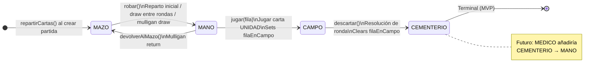
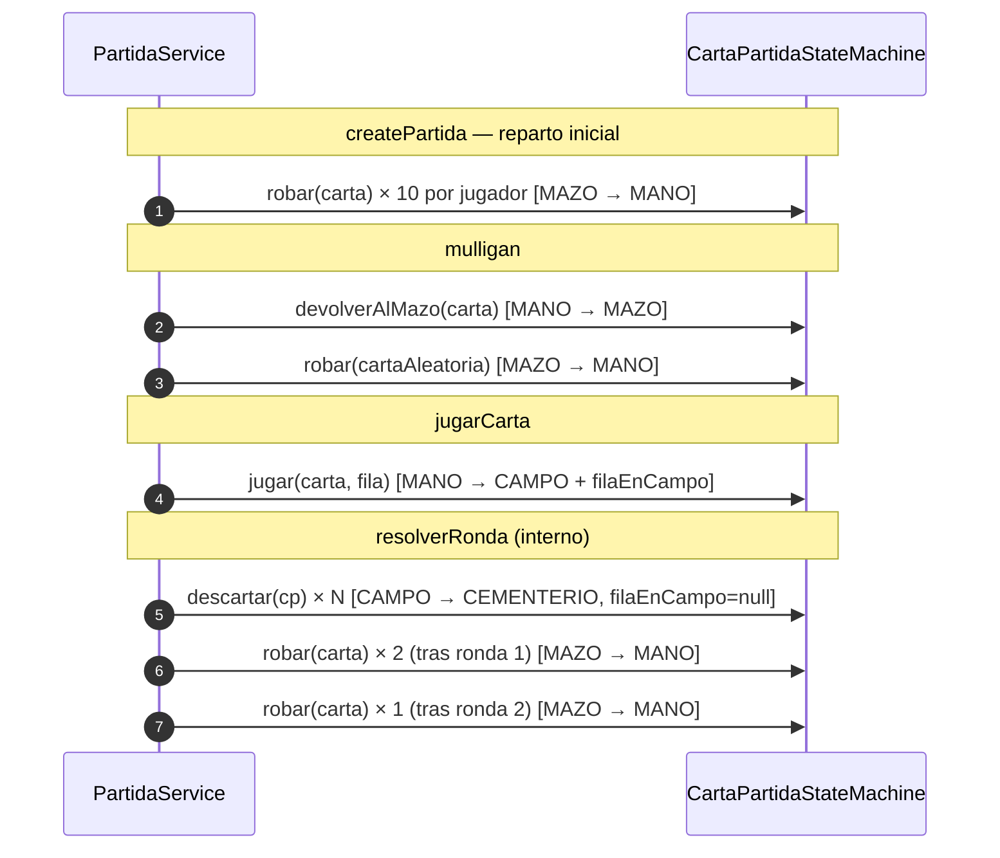

# Máquina de estados de cartas — ingame-service

Este documento describe el diseño y funcionamiento de `CartaPartidaStateMachine`, el componente que centraliza todas las transiciones de estado de las cartas durante una partida.

---

## Por qué existe

Antes de la máquina de estados, las transiciones de zona estaban dispersas en seis puntos distintos de `PartidaService`:

```java
// Antes — disperso, sin validación, efectos secundarios repetidos
carta.setZona(ZonaCarta.CEMENTERIO);
carta.setFilaEnCampo(null);          // ← fácil de olvidar
```

Ese modelo presentaba tres problemas:

1. **Sin validación de transición** — era posible escribir `CEMENTERIO → CAMPO` sin ningún error.
2. **Efectos secundarios duplicados** — `filaEnCampo` debía limpiarse manualmente en cada punto donde una carta salía del campo.
3. **Extensibilidad nula** — agregar una nueva transición (ej. habilidad MEDICO: `CEMENTERIO → MANO`) requería buscar y modificar múltiples métodos en `PartidaService`.

`CartaPartidaStateMachine` resuelve los tres problemas: un único lugar que conoce qué transiciones son legales, ejecuta los efectos secundarios y falla explícitamente si se intenta algo inválido.

---

## Estados

Los estados son valores del enum `ZonaCarta` (`ingame-service/.../domain/enums/ZonaCarta.java`). Cada valor representa la ubicación física de una carta dentro de una partida.

| Estado | Tabla | Descripción |
|---|---|---|
| `MAZO` | `gw_carta_partida` | La carta está en el mazo del jugador, pendiente de ser robada. |
| `MANO` | `gw_carta_partida` | La carta está en la mano del jugador, lista para jugarse. Solo el propio jugador la ve. |
| `CAMPO` | `gw_carta_partida` | La carta fue jugada en el tablero. Siempre visible. `filaEnCampo` indica en qué fila. |
| `CEMENTERIO` | `gw_carta_partida` | La carta fue descartada al resolver una ronda. Visible para ambos jugadores. |

> Cada `CartaPartida` es una fila independiente. Si un mazo declara "Infantería x3", se crean tres instancias de `CartaPartida`, cada una con su propio `zona`.

---

## Diagrama de estados



---

## Mapa de transiciones

```
MAZO        ──── robar() ──────────────► MANO
MANO        ──── devolverAlMazo() ──────► MAZO
MANO        ──── jugar(fila) ───────────► CAMPO
CAMPO       ──── descartar() ───────────► CEMENTERIO
CEMENTERIO  ──── (ninguna) ─────────────► terminal
```

Implementado como `Map<ZonaCarta, EnumSet<ZonaCarta>>` en `CartaPartidaStateMachine`:

```java
private static final Map<ZonaCarta, EnumSet<ZonaCarta>> TRANSICIONES = Map.of(
    ZonaCarta.MAZO,       EnumSet.of(ZonaCarta.MANO),
    ZonaCarta.MANO,       EnumSet.of(ZonaCarta.MAZO, ZonaCarta.CAMPO),
    ZonaCarta.CAMPO,      EnumSet.of(ZonaCarta.CEMENTERIO),
    ZonaCarta.CEMENTERIO, EnumSet.noneOf(ZonaCarta.class)
);
```

---

## API pública del componente

**Clase:** `com.arimar.gwent.ingameservice.service.CartaPartidaStateMachine`  
**Spring bean:** `@Component` — se inyecta por constructor en `PartidaService`.

---

### `robar(CartaPartida carta)`

**Transición:** `MAZO → MANO`

**Cuándo se usa:**

| Contexto | Llamado desde |
|---|---|
| Reparto inicial al crear la partida | `PartidaService.repartirCartas()` |
| Draw aleatorio durante mulligan | `PartidaService.mulligan()` |
| Robo de cartas entre rondas | `PartidaService.robarCartas()` |

**Efectos secundarios:** ninguno (solo cambia `zona`).

```java
// Ejemplo de uso
cartaStateMachine.robar(carta);   // carta.zona: MAZO → MANO
```

---

### `devolverAlMazo(CartaPartida carta)`

**Transición:** `MANO → MAZO`

**Cuándo se usa:** cuando el jugador devuelve una carta durante la fase de mulligan.

**Efectos secundarios:** ninguno.

```java
cartaStateMachine.devolverAlMazo(carta);   // carta.zona: MANO → MAZO
```

---

### `jugar(CartaPartida carta, FilaCarta fila)`

**Transición:** `MANO → CAMPO`

**Cuándo se usa:** cuando el jugador con turno juega una carta UNIDAD.

**Efectos secundarios:** establece `carta.filaEnCampo = fila`.  
La fila ya fue validada y resuelta por `PartidaService.determinarFila()` antes de llegar aquí:
- Cartas con `fila = AGIL` → la fila viene del request (`CUERPO_A_CUERPO` o `DISTANCIA`).
- Resto de cartas → la fila proviene de `CartaCatalogo.fila`, el request se ignora.

```java
FilaCarta filaDestino = determinarFila(carta, req.getFila());
cartaStateMachine.jugar(cartaPartida, filaDestino);
// cartaPartida.zona: MANO → CAMPO
// cartaPartida.filaEnCampo: null → filaDestino
```

---

### `descartar(CartaPartida carta)`

**Transición:** `CAMPO → CEMENTERIO`

**Cuándo se usa:** al resolver una ronda, todas las cartas del campo de ambos jugadores pasan al cementerio.

**Efectos secundarios:** limpia `carta.filaEnCampo = null`.

```java
// Resolución de ronda — ambos campos de una vez
campoJ1.forEach(cartaStateMachine::descartar);
campoJ2.forEach(cartaStateMachine::descartar);
// zona: CAMPO → CEMENTERIO
// filaEnCampo: <valor> → null
```

---

## Manejo de transiciones inválidas

El método interno `transicionar()` valida que la transición solicitada esté en el mapa antes de aplicarla:

```java
private void transicionar(CartaPartida carta, ZonaCarta destino) {
    ZonaCarta origen = carta.getZona();
    EnumSet<ZonaCarta> permitidos = TRANSICIONES.getOrDefault(origen, EnumSet.noneOf(ZonaCarta.class));
    if (!permitidos.contains(destino)) {
        throw new IllegalStateException(
            "Transición de carta inválida: %s → %s (cartaPartidaId=%d)"
                .formatted(origen, destino, carta.getId())
        );
    }
    carta.setZona(destino);
}
```

`IllegalStateException` es intencionalmente un error de servidor (no de cliente):
- Si ocurre en producción, **es un bug en la lógica de juego**, no un input inválido.
- `GlobalExceptionHandler` de ingame-service la captura y devuelve `500 Internal Server Error`.
- El mensaje incluye `origen`, `destino` y `cartaPartidaId` para facilitar el diagnóstico.

Las validaciones de negocio (carta no en mano, no es tu turno, etc.) siguen siendo responsabilidad de `PartidaService` y usan `ResponseStatusException` con códigos `4xx` apropiados.

---

## Dónde vive cada transición en el flujo de la partida



---

## Visibilidad del estado por zona

La vista de la partida es asimétrica: cada jugador ve su propia mano completa, pero solo el conteo de la mano del oponente. El resto de las zonas son públicas.

| Zona | Jugador propio | Oponente |
|---|---|---|
| `MANO` | Lista completa de cartas | Solo `manoCount` (entero) |
| `MAZO` | Solo `mazoCount` | Solo `mazoCount` |
| `CAMPO` | Cartas visibles por fila | Cartas visibles por fila |
| `CEMENTERIO` | Lista completa | Lista completa |

Esta lógica vive en `PartidaService.buildJugadorDTO()`: cuando `esMio = false`, se pasa `mano = null`.

---

## Cómo extender la máquina de estados

Para agregar una nueva transición (ej. habilidad **MEDICO**: revivir carta del cementerio a la mano):

**1. Actualizar el mapa de transiciones:**

```java
// Antes
ZonaCarta.CEMENTERIO, EnumSet.noneOf(ZonaCarta.class)

// Después
ZonaCarta.CEMENTERIO, EnumSet.of(ZonaCarta.MANO)
```

**2. Agregar el método semántico:**

```java
/**
 * CEMENTERIO → MANO. Habilidad MEDICO: revive una carta del cementerio.
 */
public void revivirCarta(CartaPartida carta) {
    transicionar(carta, ZonaCarta.MANO);
}
```

**3. Usar el método desde `PartidaService`** al resolver la habilidad MEDICO, sin tocar el resto del servicio.

No se modifica la lógica de validación, ni los métodos existentes, ni la entidad. El estado terminal de `CEMENTERIO` pasa a no serlo solo actualizando el mapa.

---

## Archivos relevantes

| Archivo | Rol |
|---|---|
| [CartaPartidaStateMachine.java](ingame-service/src/main/java/com/arimar/gwent/ingameservice/service/CartaPartidaStateMachine.java) | Implementación de la máquina de estados |
| [PartidaService.java](ingame-service/src/main/java/com/arimar/gwent/ingameservice/service/PartidaService.java) | Lógica de juego que consume la máquina de estados |
| [ZonaCarta.java](ingame-service/src/main/java/com/arimar/gwent/ingameservice/domain/enums/ZonaCarta.java) | Enum con los estados posibles |
| [CartaPartida.java](ingame-service/src/main/java/com/arimar/gwent/ingameservice/entity/CartaPartida.java) | Entidad que tiene `zona` y `filaEnCampo` |
| [GlobalExceptionHandler.java](ingame-service/src/main/java/com/arimar/gwent/ingameservice/exception/GlobalExceptionHandler.java) | Captura `IllegalStateException` → HTTP 500 |
