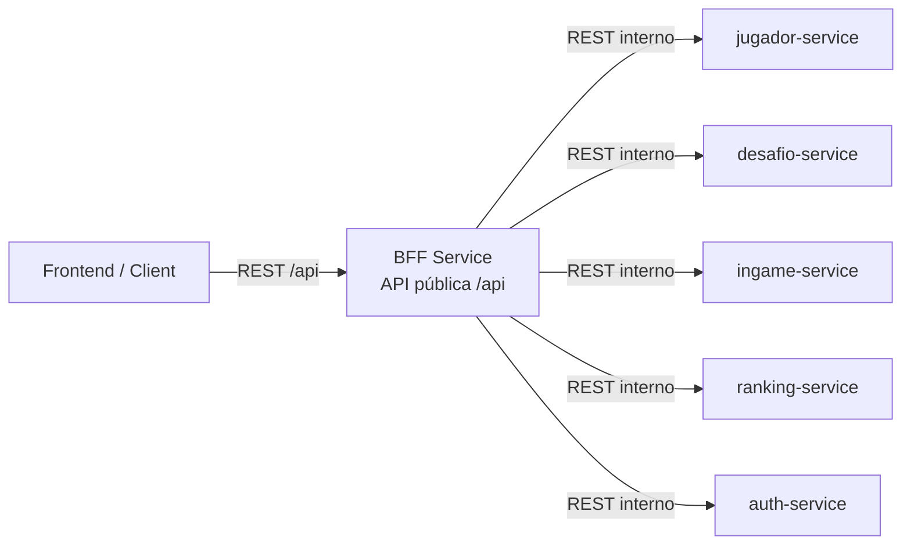
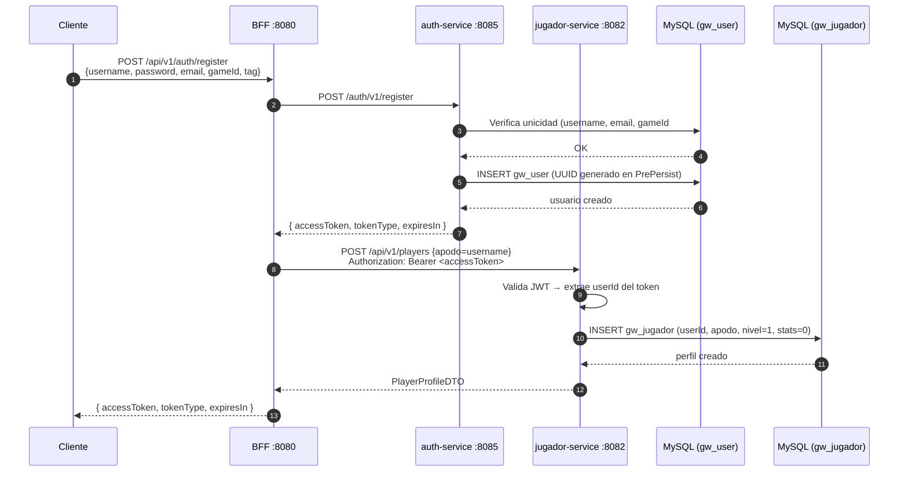
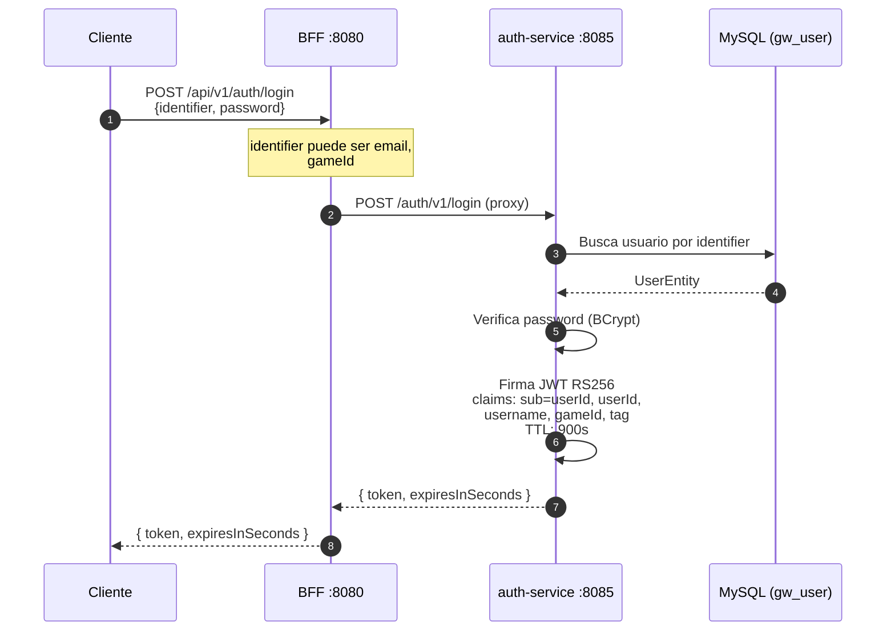
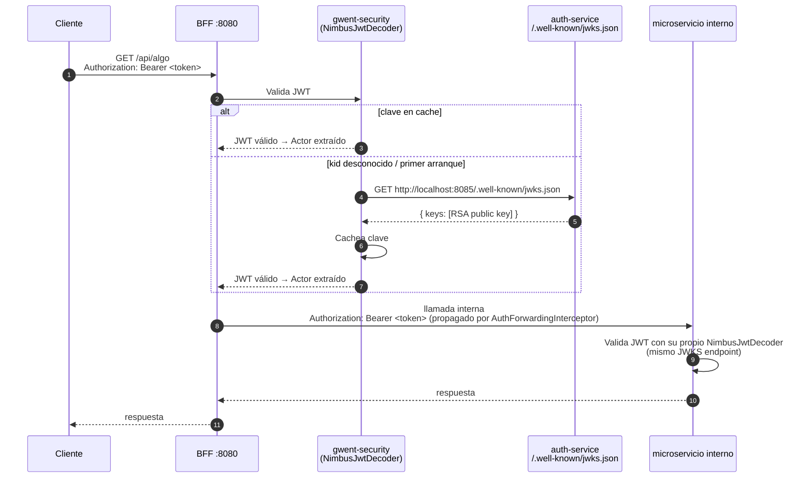

# Ms-Gwent

Backend para una aplicación de simulación del juego **Gwent (The Witcher 3)**, basado en **microservicios con Spring Boot** y un **BFF (Backend for Frontend)** como único punto de entrada.

> **Estado del proyecto:** En desarrollo activo. auth-service, jugador-service, ingame-service y bff-service son funcionales. solicitud-service es un esqueleto vacío.

---

## Arquitectura general

- El **frontend nunca consume microservicios directamente**.
- El **BFF** expone la API pública (`/api/**`) y orquesta llamadas internas.
- La identidad del jugador (**actor**) se obtiene siempre desde autenticación.
- El `playerId` del actor **nunca viaja desde el cliente en el body**.

### Servicios

| Servicio | Puerto | Estado |
|---|---|---|
| **bff-service** | 8080 | Funcional — punto de entrada público `/api/**` |
| **jugador-service** | 8082 | Funcional — perfiles de jugador |
| **ingame-service** | 8083 | Funcional — catálogo de cartas, desbloqueo, mazos y partidas (MVP) |
| **auth-service** | 8085 | Funcional — autenticación JWT RS256 |
| **solicitud-service** | — | Esqueleto vacío |
| **ranking-service** | — | No existe aún |

---

## Diagrama de arquitectura (Containers)



---

## Autenticación y seguridad

### Mecanismo JWT (RS256)

- **auth-service** emite tokens firmados con `private.pem` (RS256, Nimbus).
- **bff-service** y demás microservicios validan tokens usando el endpoint JWKS dinámico del auth-service.
- La clave pública se descarga una sola vez y se cachea. Solo se re-descarga si aparece un `kid` desconocido (permite rotación de claves sin redesploy).
- El auto-config centralizado vive en `gwent-security` (`GwentJwtDecoderAutoConfig`) y se activa con la propiedad `gwent.security.jwt.jwks-uri`.

### Flujo: registro de usuario



### Flujo: login y obtención del JWT



### Flujo: request autenticado (BFF → microservicio interno)



---

## Gestión de identidad (regla base)

- El **actorPlayerId** se obtiene desde el token en el BFF.
- El cliente **no envía playerId del actor**.
- El BFF propaga el Bearer token completo a los microservicios internos (via `AuthForwardingInterceptor`).
- Cada microservicio reconstruye el `Actor` del JWT con su propio `ActorResolver`.

JWT claims:
```json
{
  "sub": "uuid-del-usuario",
  "userId": "uuid-del-usuario",
  "username": "JohnDoe",
  "gameId": "player99",
  "tag": "1234"
}
```

---

# API pública (BFF)

Todos los endpoints expuestos al frontend viven bajo `/api`.

---

## 0. Autenticación

### Registro
```
POST /api/v1/auth/register
Body: { "username": "string", "password": "string", "email": "string", "gameId": "string", "tag": "string" }
```
Crea usuario en auth-service y perfil en jugador-service. Devuelve JWT.

### Login
```
POST /api/v1/auth/login
Body: { "identifier": "string", "password": "string" }
```
`identifier` puede ser `username`, `email` o `gameId#tag`. Devuelve JWT.

### Cambiar contraseña
```
PATCH /api/v1/auth/password
Authorization: Bearer <token>
Body: { "currentPassword": "string", "newPassword": "string" }
```
Requiere JWT. Verifica la contraseña actual antes de actualizar.

---

## 1. Jugadores

El perfil de jugador se crea automáticamente en `jugador-service` cuando el usuario se registra (ver flujo de registro). La entidad `JugadorEntity` vive en jugador-service y está vinculada al `userId` de auth-service.

### Campos del perfil de jugador (`gw_jugador`)
| Campo | Tipo | Descripción |
|---|---|---|
| `userId` | UUID (PK) | Igual al `userId` de `UserEntity` en auth-service |
| `apodo` | String (unique) | Nombre de pantalla. Inicialmente = `username` del registro |
| `avatarUrl` | String | Opcional |
| `nivel` | int | Empieza en 1 |
| `victorias` | int | Contador de victorias |
| `derrotas` | int | Contador de derrotas |
| `empates` | int | Contador de empates |
| `createdAt` | LocalDateTime | Timestamp de creación |

### Endpoint interno: crear perfil
```
POST /api/v1/players          (jugador-service interno, puerto 8082)
Authorization: Bearer <token>
Body: { "apodo": "string" }
```
Llamado por el BFF durante el registro. El `userId` se extrae del JWT.

---

### Obtener mi perfil ✅
```
GET /api/players/me
Authorization: Bearer <token>
```
Devuelve el perfil del jugador autenticado. Si el perfil no existe aún, se crea automáticamente (lazy creation).

### Actualizar mi perfil ✅
```
PATCH /api/players/me
Authorization: Bearer <token>
Body: { "apodo": "string", "avatarUrl": "string" }
```
Ambos campos son opcionales. Devuelve el perfil actualizado.

### Obtener perfil público de otro jugador
```
GET /api/players/{playerId}
```
**TO DO** — Implementar en jugador-service y exponer vía BFF.

### Eliminar mi perfil
```
DELETE /api/players/me
```
**TO DO** — Verificar partidas activas antes de eliminar.

---

## 2. Cartas

### Listar cartas del catálogo ✅
```
GET /api/v1/cards
GET /api/v1/cards?faccion=REINO_DEL_NORTE&fila=ASEDIO
GET /api/v1/cards?esEspecial=true
GET /api/v1/cards?esHeroe=true&habilidad=MEDICO
Authorization: Bearer <token>
```
Devuelve el catálogo global de cartas. Todos los filtros son opcionales y combinables entre sí:

| Param | Tipo | Valores |
|---|---|---|
| `faccion` | enum | `REINO_DEL_NORTE`, `NILFGAARD`, `MONSTRUOS`, `SCOIA_TAEL`, `SKELLIGE`, `NEUTRAL` |
| `fila` | enum | `CUERPO_A_CUERPO`, `DISTANCIA`, `ASEDIO`, `AGIL` |
| `tipo` | enum | `UNIDAD`, `CLIMA`, `ESPECIAL`, `LIDER` |
| `esHeroe` | boolean | `true` / `false` |
| `habilidad` | enum | `NINGUNA`, `ESPIA`, `MEDICO`, `ENLACE_APRETADO`, `REFUERZO_MORAL`, `DECOY`, `COMANDANTE_INVOCACION`, `ESCUDO_IMPENETRABLE`, `VÍNCULO_ESTRECHO`, `MUSTER` |
| `esEspecial` | boolean | `true` → retorna tipo `CLIMA` + `ESPECIAL`. Tiene precedencia sobre `tipo`. |

### Obtener carta por ID ✅
```
GET /api/v1/cards/{id}
Authorization: Bearer <token>
```
Devuelve una carta específica del catálogo.

### Campos de la carta (`gw_carta_catalogo`)
| Campo | Tipo | Descripción |
|---|---|---|
| `id` | Long (PK) | Autoincremental |
| `nombre` | String | Nombre de la carta |
| `faccion` | Enum | `REINO_DEL_NORTE`, `NILFGAARD`, `MONSTRUOS`, `SCOIA_TAEL`, `SKELLIGE`, `NEUTRAL` |
| `tipo` | Enum | `UNIDAD`, `CLIMA`, `ESPECIAL`, `LIDER` |
| `fila` | Enum (nullable) | `CUERPO_A_CUERPO`, `DISTANCIA`, `ASEDIO`, `AGIL` |
| `fuerza` | Integer (nullable) | Fuerza de la unidad |
| `habilidad` | Enum | `NINGUNA`, `ESPIA`, `MEDICO`, `ENLACE_APRETADO`, `REFUERZO_MORAL`, `DECOY`, `COMANDANTE_INVOCACION`, `ESCUDO_IMPENETRABLE`, `VÍNCULO_ESTRECHO`, `MUSTER` |
| `esHeroe` | boolean | Las cartas héroe no se ven afectadas por efectos de clima |
| `imagenUrl` | String (nullable) | URL de la imagen |
| `createdAt` | LocalDateTime | Timestamp de creación |
| `modifiedAt` | LocalDateTime (nullable) | Última modificación |
| `deletedAt` | LocalDateTime (nullable) | Soft delete |

---

## 3. Desbloqueo de cartas

### Desbloquear múltiples cartas ✅
```
POST /api/v1/players/me/cards
Authorization: Bearer <token>
Body: { "cardIds": [1, 2, 3] }
```
Desbloquea una o más cartas del catálogo para el jugador autenticado. Las cartas ya desbloqueadas se omiten silenciosamente (idempotente). Devuelve solo las cartas **recién** desbloqueadas.

### Listar mis cartas desbloqueadas ✅
```
GET /api/v1/players/me/cards
Authorization: Bearer <token>
```
Devuelve todas las cartas desbloqueadas del jugador autenticado, incluyendo los datos completos de cada carta del catálogo y la fecha de desbloqueo.

### Campos de la respuesta (`CartaJugadorDTO`)
| Campo | Tipo | Descripción |
|---|---|---|
| `id` | Long | ID del registro de desbloqueo |
| `cantidad` | int | Copias que posee el jugador |
| `unlockedAt` | LocalDateTime | Fecha y hora del primer desbloqueo |
| `carta` | CartaCatalogoDTO | Datos completos de la carta (incluye `maxCopias`) |

---

## 4. Mazos ✅

Los mazos pertenecen a una facción específica y contienen cartas desbloqueadas por el jugador. Un mazo puede tener un líder (carta de tipo `LIDER`) y un conjunto de cartas de unidad/especial/clima de su facción o NEUTRAL.

**Reglas de negocio:**
- Máximo **3 mazos por facción** por jugador (1 activo + 2 inactivos)
- Se necesitan al menos **22 cartas de tipo UNIDAD** para poder **activar** un mazo
- Solo cartas de la **misma facción** o **NEUTRAL**
- Solo cartas que el jugador tenga **desbloqueadas**
- Las cartas **no quedan bloqueadas** al mazo — pueden estar en múltiples mazos simultáneamente
- **1 líder** por mazo (campo separado, opcional al crear/guardar, requerido para jugar)
- Solo puede haber **1 mazo activo** por facción; al activar otro, el anterior queda INACTIVO

### Crear mazo ✅
```
POST /api/v1/players/me/mazos
Authorization: Bearer <token>
Body: { "nombre": "string", "faccion": "REINO_DEL_NORTE", "liderId": 32, "cardEntries": [{ "cartaCatalogoId": 5, "cantidad": 1 }] }
```
`liderId` y `cardEntries` son opcionales al crear.

**Errores:** `409` si ya existen 3 mazos de la misma facción · `422` si carta es de otra facción · `422` si carta no desbloqueada · `422` si se pasa un líder en `cardEntries`

### Listar mis mazos ✅
```
GET /api/v1/players/me/mazos
Authorization: Bearer <token>
```

### Obtener mazo por ID ✅
```
GET /api/v1/players/me/mazos/{id}
Authorization: Bearer <token>
```

### Editar mazo ✅
```
PUT /api/v1/players/me/mazos/{id}
Authorization: Bearer <token>
Body: { "nombre": "string", "liderId": 33, "cardEntries": [...] }
```
Todos los campos son opcionales. `liderId: null` → no cambia el líder · `liderId: -1` → quita el líder. `cardEntries` reemplaza todas las cartas del mazo si se envía.

### Activar mazo ✅
```
PATCH /api/v1/players/me/mazos/{id}/activate
Authorization: Bearer <token>
```
Activa el mazo dentro de su facción. El mazo activo anterior de esa facción pasa a INACTIVO.

**Errores:** `422` si el mazo tiene menos de 22 unidades.

### Eliminar mazo ✅
```
DELETE /api/v1/players/me/mazos/{id}
Authorization: Bearer <token>
```
Responde `204 No Content`. Las `MazoCarta` se eliminan en cascada.

### Campos de la respuesta (`MazoDTO`)
| Campo | Tipo | Descripción |
|---|---|---|
| `id` | Long | ID del mazo |
| `nombre` | String | Nombre del mazo |
| `faccion` | String | Facción del mazo |
| `estado` | String | `ACTIVO` / `INACTIVO` |
| `lider` | CartaCatalogoDTO (nullable) | Carta líder asignada |
| `cartas` | List\<MazoCartaDTO\> | Cartas del mazo con cantidad |
| `totalUnidades` | int | Total de unidades (suma de `cantidad` para tipo UNIDAD) |
| `createdAt` | LocalDateTime | Timestamp de creación |
| `modifiedAt` | LocalDateTime (nullable) | Última modificación |

### Cartas líder

Hay 2 líderes por facción (10 en total). Son cartas del catálogo con `tipo=LIDER`, sin fila ni fuerza, `esHeroe=true`, `maxCopias=1`. Se asignan al mazo por `liderId` (ID de `gw_carta_catalogo`). El jugador debe haberlas desbloqueado previamente.

### Datos de seed (`seed-data.sql`)
Incluye 31 cartas normales y 10 líderes. Ejecutar manualmente en MySQL antes de usar.

---

## 5. Desafíos

**TO DO** — Pendiente de implementar en `solicitud-service`.

Endpoints planeados:
```
POST /api/challenges                       → Enviar desafío
GET  /api/challenges/inbox                 → Desafíos recibidos
GET  /api/challenges/outbox                → Desafíos enviados
POST /api/challenges/{id}/accept           → Aceptar desafío
POST /api/challenges/{id}/reject           → Rechazar desafío
POST /api/challenges/{id}/cancel           → Cancelar desafío
```

---

## 6. Partidas ✅ (MVP)

Lógica de partidas implementada en `ingame-service`. Dos jugadores se enfrentan con mazos activos en formato **best-of-3** rondas. Cada jugador empieza con **2 vidas** y pierde 1 al perder o empatar una ronda.

> **MVP:** Solo cartas de tipo `UNIDAD` son jugables. Habilidades de cartas, efectos de clima/especiales y habilidades de líder no están implementados aún.

### Endpoints internos (`ingame-service :8083`)

| Método | Path | Descripción |
|---|---|---|
| `POST` | `/ingame/v1/partidas` | Crear partida |
| `GET` | `/ingame/v1/partidas/{id}` | Ver estado de la partida |
| `POST` | `/ingame/v1/partidas/{id}/mulligan` | Fase de mulligan (intercambiar 0-2 cartas) |
| `POST` | `/ingame/v1/partidas/{id}/jugar-carta` | Jugar carta en una fila |
| `POST` | `/ingame/v1/partidas/{id}/pasar` | Pasar turno (definitivo para la ronda) |

### Flujo del juego

```
CREAR PARTIDA → Repartir 10 cartas → MULLIGAN → EN_CURSO (Ronda 1)
  → Jugar carta / Pasar → Ambos pasan → Resolver ronda
  → ¿Fin? → TERMINADA  |  → Robar cartas → Siguiente ronda
```

### Crear partida
```
POST /ingame/v1/partidas
Authorization: Bearer <token>
Body: { "oponenteId": "uuid", "mazoId": 5, "mazoOponenteId": 8 }
```
Ambos mazos deben estar `ACTIVO`. Se reparten 10 cartas aleatorias a cada jugador. Estado inicial: `MULLIGAN`. Turno inicial: aleatorio.

> `mazoOponenteId` es temporal para testing. Será reemplazado cuando `solicitud-service` gestione la aceptación del desafío.

### Mulligan
```
POST /ingame/v1/partidas/{id}/mulligan
Authorization: Bearer <token>
Body: { "cartaPartidaIds": [101, 105] }
```
Cada jugador puede intercambiar **0 a 2** cartas de su mano por cartas aleatorias del mazo. Array vacío = skip. Cuando ambos completan el mulligan → estado cambia a `EN_CURSO`, ronda 1.

### Jugar carta
```
POST /ingame/v1/partidas/{id}/jugar-carta
Authorization: Bearer <token>
Body: { "cartaPartidaId": 101, "fila": "CUERPO_A_CUERPO" }
```
Solo el jugador con turno puede jugar. Solo cartas `UNIDAD`. La fila se determina automáticamente según la carta, excepto cartas `AGIL` que requieren `fila` en el request (`CUERPO_A_CUERPO` o `DISTANCIA`). Si el oponente ya pasó, el jugador mantiene el turno. Auto-pass si la mano queda vacía.

### Pasar turno
```
POST /ingame/v1/partidas/{id}/pasar
Authorization: Bearer <token>
```
El jugador deja de jugar cartas por el resto de la ronda. Cuando ambos han pasado se resuelve la ronda.

### Resolución de ronda
- Se suma la fuerza de las cartas en campo de cada jugador
- Mayor fuerza gana; empate = ambos pierden 1 vida
- Todas las cartas del campo van al cementerio
- Entre rondas se roban cartas del mazo: **2** tras ronda 1, **1** tras ronda 2
- El ganador de la ronda va primero en la siguiente

### Vista asimétrica (`PartidaDTO`)
Cada jugador ve su propia mano pero **no** la del oponente (solo el count). Tableros y cementerios de ambos son visibles.

| Campo | Tipo | Descripción |
|---|---|---|
| `id` | Long | ID de la partida |
| `estado` | Enum | `MULLIGAN`, `EN_CURSO`, `TERMINADA` |
| `rondaActual` | int | Número de ronda (1-3) |
| `esMiTurno` | boolean | Si es el turno del jugador autenticado |
| `yo` | JugadorPartidaDTO | Estado propio (mano visible, tablero, cementerio, vidas) |
| `oponente` | JugadorPartidaDTO | Estado del oponente (mano=null, manoCount visible) |
| `rondas` | List\<RondaDTO\> | Historial de rondas con puntajes relativos |
| `ganadorId` | UUID (nullable) | Ganador de la partida |
| `empate` | boolean | Si la partida terminó en empate |

### Entidades de la partida

| Tabla | Descripción |
|---|---|
| `gw_partida` | Partida con 2 jugadores, estado, vidas, turno, resultado |
| `gw_carta_partida` | Cada instancia de carta en la partida (zona: MAZO/MANO/CAMPO/CEMENTERIO) |
| `gw_ronda` | Resultado de cada ronda (puntajes, ganador, empate) |

---

## Manejo de errores

Todos los servicios devuelven errores con la estructura `ErrorDTO`:

```json
{
  "serviceOrigin": "jugador-service",
  "status": 404,
  "message": "Player not found",
  "type": null,
  "path": null,
  "body": null
}
```

El BFF propaga el `ErrorDTO` del servicio interno al cliente con el mismo código HTTP. Los errores de transporte (servicio caído) se traducen a `502 Bad Gateway`.

---

## Próximos pasos

- Habilidades de cartas (ESPIA, MEDICO, ENLACE_APRETADO, REFUERZO_MORAL, etc.)
- Efectos de clima y cartas especiales
- Habilidades de líder
- Exponer partidas vía BFF
- solicitud-service: ciclo de vida de desafíos
- Ranking y estadísticas

---

**Este README define el contrato de la API y la arquitectura base del proyecto.**

