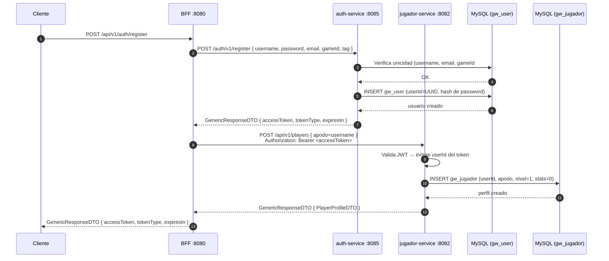
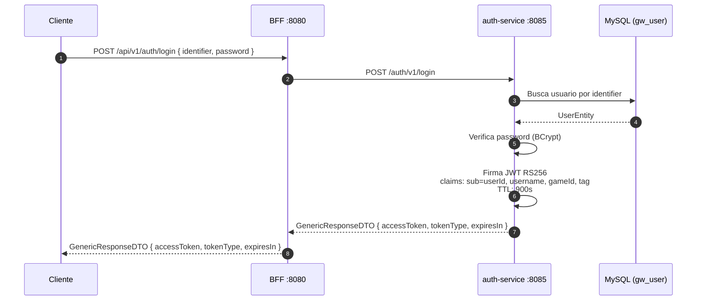
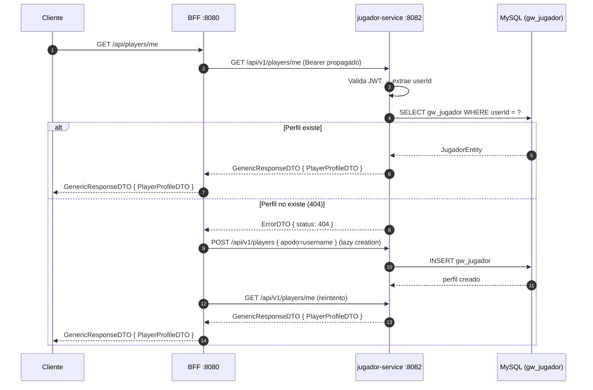
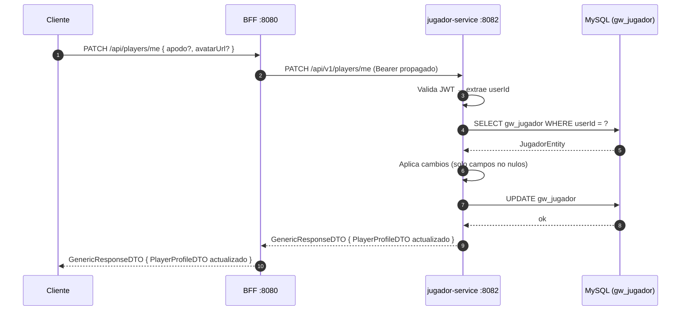
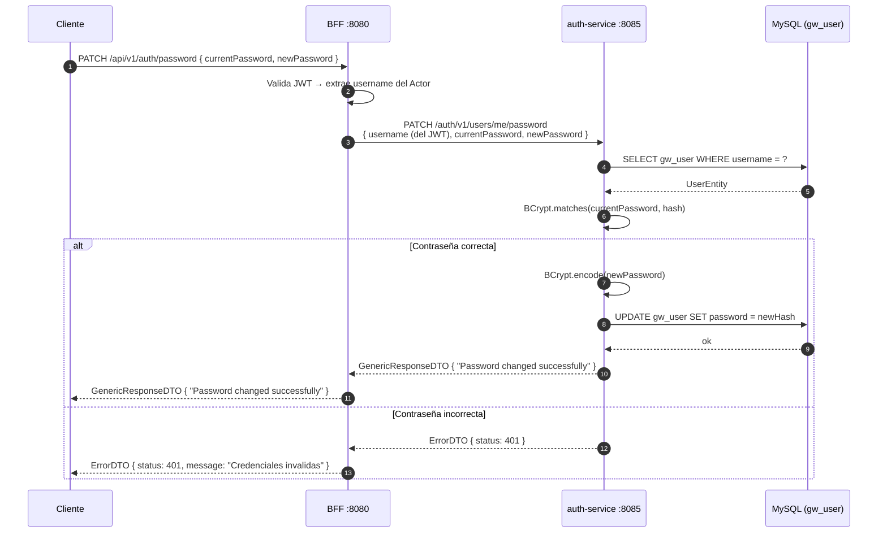
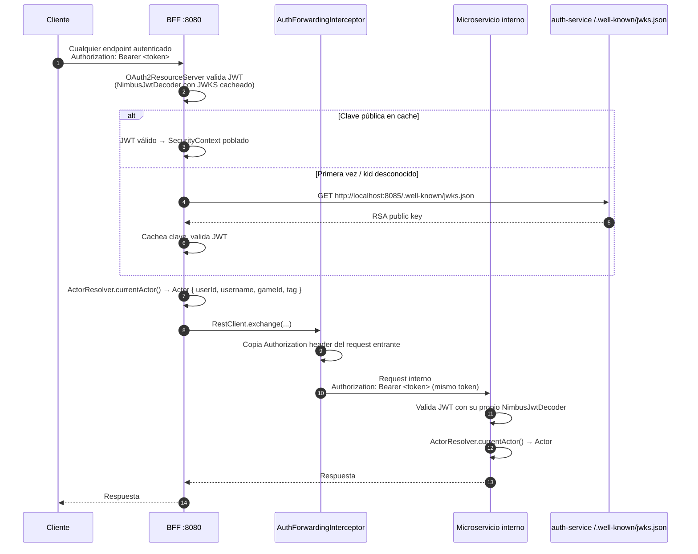
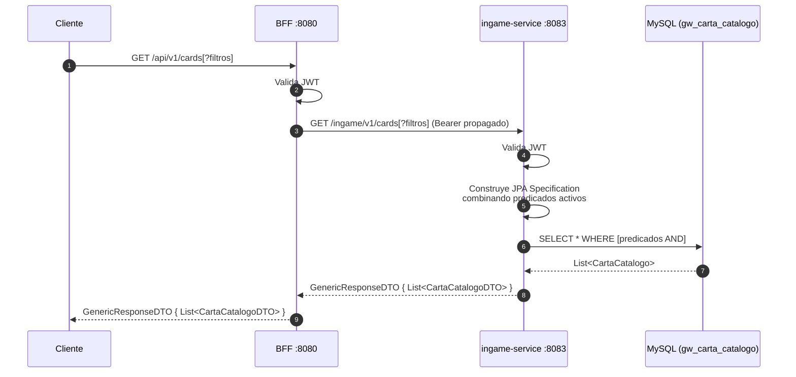
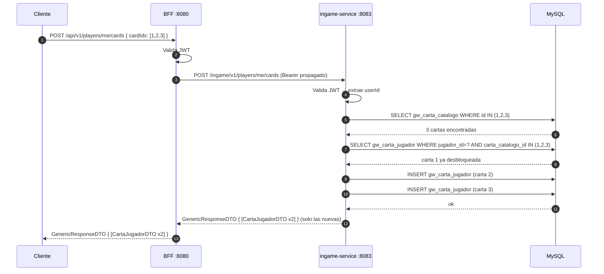
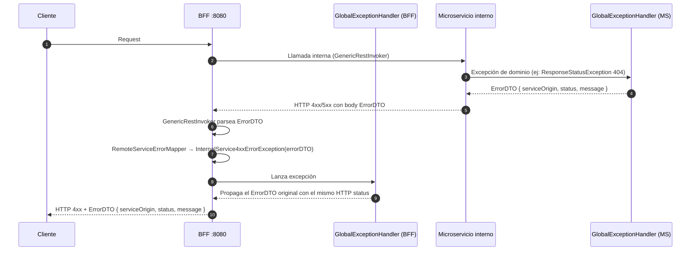

# Ms-Gwent — Diagramas de flujo de negocio

Cada sección describe una acción del usuario, el endpoint del BFF que debe invocar, y las llamadas internas que se realizan.

---

## 1. Registro de usuario

**Acción:** El usuario crea una cuenta por primera vez.

```
POST /api/v1/auth/register
Body: { username, password, email, gameId, tag }
```



**Errores posibles:**
- `409 Conflict` — username, email o gameId#tag ya en uso

---

## 2. Login

**Acción:** El usuario inicia sesión y obtiene un JWT.

```
POST /api/v1/auth/login
Body: { identifier, password }
```
> `identifier` puede ser `username`, `email` o `gameId#tag`



**Errores posibles:**
- `401 Unauthorized` — credenciales incorrectas

---

## 3. Obtener mi perfil de jugador

**Acción:** El usuario autenticado consulta su propio perfil.

```
GET /api/players/me
Authorization: Bearer <token>
```



**Nota:** La creación lazy ocurre cuando el registro falló silenciosamente en jugador-service pero el usuario ya existe en auth-service.

---

## 4. Actualizar mi perfil de jugador

**Acción:** El usuario cambia su apodo o avatar.

```
PATCH /api/players/me
Authorization: Bearer <token>
Body: { apodo?, avatarUrl? }
```



**Errores posibles:**
- `404 Not Found` — perfil no existe
- `409 Conflict` — el apodo ya está en uso por otro jugador

---

## 5. Cambiar contraseña

**Acción:** El usuario autenticado cambia su contraseña.

```
PATCH /api/v1/auth/password
Authorization: Bearer <token>
Body: { currentPassword, newPassword }
```



---

## 6. Flujo de propagación de JWT entre servicios

**Contexto:** Cómo el token viaja del cliente hasta los microservicios internos en cualquier request autenticado.



---

## 7. Consultar catálogo de cartas

**Acción:** El usuario autenticado consulta el catálogo de cartas con filtros combinables.

```
GET /api/v1/cards
GET /api/v1/cards?faccion=REINO_DEL_NORTE&fila=ASEDIO
GET /api/v1/cards?esEspecial=true
GET /api/v1/cards?esHeroe=true&habilidad=MEDICO
GET /api/v1/cards/{id}
Authorization: Bearer <token>
```

Filtros disponibles (todos opcionales, combinables): `faccion`, `fila`, `tipo`, `esHeroe`, `habilidad`, `esEspecial` (tipo CLIMA + ESPECIAL, tiene precedencia sobre `tipo`).



**Errores posibles:**
- `400 Bad Request` — valor de enum inválido (incluye valores permitidos en el mensaje)
- `404 Not Found` — carta no encontrada (solo para `GET /cards/{id}`)

---

## 8. Flujo de errores entre servicios

**Contexto:** Cómo un error en un microservicio interno llega al cliente.

## 8. Desbloquear múltiples cartas

**Acción:** El jugador desbloquea una o más cartas del catálogo en una sola llamada.

```
POST /api/v1/players/me/cards
Authorization: Bearer <token>
Body: { "cardIds": [1, 2, 3] }
```



**Errores posibles:**
- `404 Not Found` — algún `cardId` no existe en el catálogo

---

## 9. Flujo de errores entre servicios


