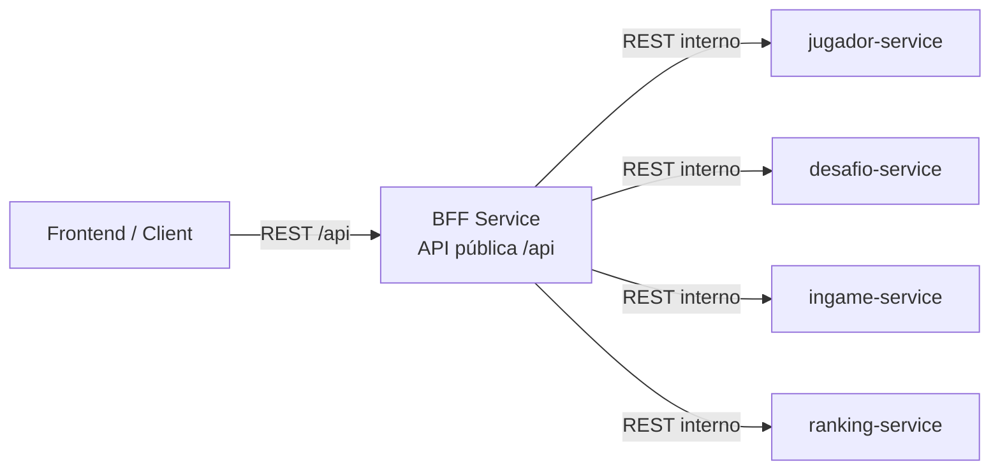
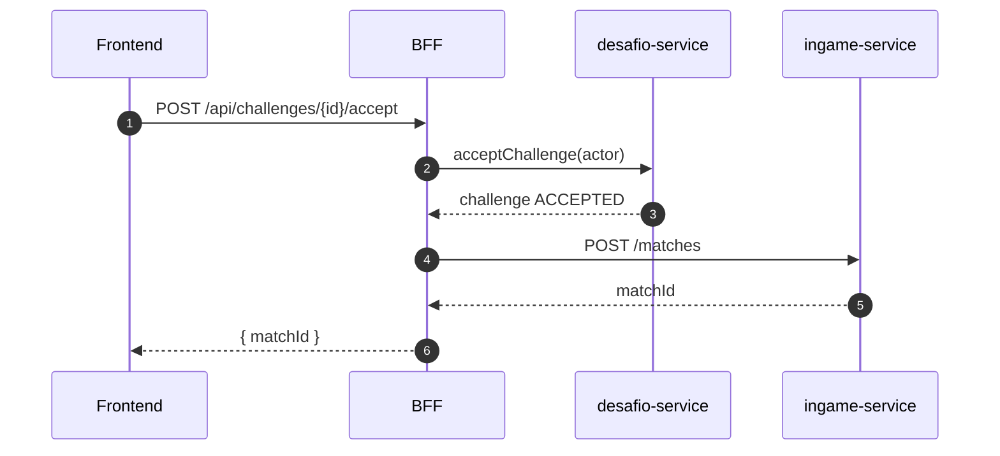
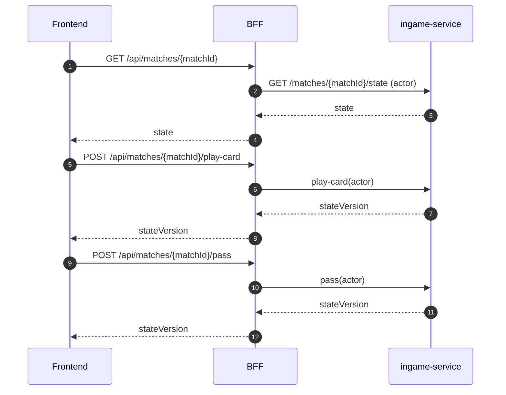

# Ms-Gwent

Backend para una aplicación de simulación del juego **Gwent (The Witcher 3)**, basado en **microservicios con Spring Boot** y un **BFF (Backend for Frontend)** como único punto de entrada.

> **Estado del proyecto:** Diseño de APIs y arquitectura (planning phase)

---

## Arquitectura general

- El **frontend nunca consume microservicios directamente**.
- El **BFF** expone la API pública (`/api/**`) y orquesta llamadas internas.
- La identidad del jugador (**actor**) se obtiene siempre desde autenticación.
- El `playerId` del actor **nunca viaja desde el cliente en el body**.

### Servicios

- **BFF Service** – Punto de entrada y orquestación
- **jugador-service** – Gestión de jugadores y perfiles
- **desafio-service** – Gestión del ciclo de vida de desafíos
- **ingame-service** – Lógica del juego, mazos, cartas y partidas
- **ranking-service** – Rankings y estadísticas (pendiente)

---

## Diagrama de arquitectura (Containers)



---

## Gestión de identidad (regla base)

- El **actorPlayerId** se obtiene desde el token en el BFF.
- El cliente **no envía playerId del actor**.
- El BFF propaga el actor a los microservicios internos.

Ejemplo interno:
```json
{
  "actorPlayerId": "uuid"
}
```

---

# API pública (BFF)

Todos los endpoints expuestos al frontend viven bajo `/api`.

---

## 1. Jugadores

### Crear jugador
```
POST /api/players
```
**Descripción:** Registra un nuevo jugador.

**TO DO**
- Hash de contraseña
- Validar unicidad (usuario / tag)

---

### Obtener jugador
```
GET /api/players/{playerId}
```
**Descripción:** Obtiene información pública del jugador.

**TO DO**
- Manejar jugador eliminado

---

### Actualizar perfil
```
PATCH /api/players/{playerId}
```
**Descripción:** Actualiza parcialmente el perfil (ej: nickname).

**TO DO**
- Validar campos permitidos
- Verificar ownership

---

### Eliminar jugador
```
DELETE /api/players/{playerId}
```
**Descripción:** Elimina un jugador.

**TO DO**
- Verificar partidas activas

---

## 2. Cartas

### Listar cartas
```
GET /api/cards
```
**Descripción:** Devuelve el catálogo de cartas precargadas.

**TO DO**
- Filtros por facción

---

## 3. Desbloqueo de cartas

### Desbloquear carta
```
POST /api/players/{playerId}/unlocks/cards
```
**Descripción:** Desbloquea una carta para el jugador.

**TO DO**
- Evitar duplicados

---

### Listar cartas desbloqueadas
```
GET /api/players/{playerId}/unlocks/cards
```
**Descripción:** Lista cartas disponibles para mazos.

**TO DO**
- Cache

---

## 4. Mazos

### Listar mazos
```
GET /api/players/{playerId}/decks
```

### Crear mazo
```
POST /api/players/{playerId}/decks
```

### Editar mazo
```
PATCH /api/decks/{deckId}
```

### Eliminar mazo
```
DELETE /api/decks/{deckId}
```

### Cartas del mazo
```
GET    /api/decks/{deckId}/cards
POST   /api/decks/{deckId}/cards
DELETE /api/decks/{deckId}/cards/{cardId}
```

**TO DO (mazos)**
- Límite de 3 mazos
- Validar cartas desbloqueadas
- Reglas de construcción

---

## 5. Desafíos

### Enviar desafío
```
POST /api/challenges
```

### Inbox / Outbox
```
GET /api/challenges/inbox
GET /api/challenges/outbox
```

### Aceptar desafío
```
POST /api/challenges/{challengeId}/accept
```

### Rechazar desafío
```
POST /api/challenges/{challengeId}/reject
```

### Cancelar desafío
```
POST /api/challenges/{challengeId}/cancel
```

**TO DO (desafíos)**
- Expiración
- Evitar duplicados

---

## Flujo: aceptar desafío → crear partida



---

## 6. Partidas

### Listar partidas
```
GET /api/matches
```

### Obtener estado de partida
```
GET /api/matches/{matchId}
```

### Jugar carta
```
POST /api/matches/{matchId}/play-card
```

### Pasar turno / ronda
```
POST /api/matches/{matchId}/pass
```

---

## Flujo: acciones in-game



---

## Próximos pasos

- Mulligan inicial
- Reglas de rondas (best of 3)
- Cartas especiales (clima, héroes)
- Ranking y estadísticas
- Eventos async

---

**Este README define el contrato de la API y la arquitectura base del proyecto.**

